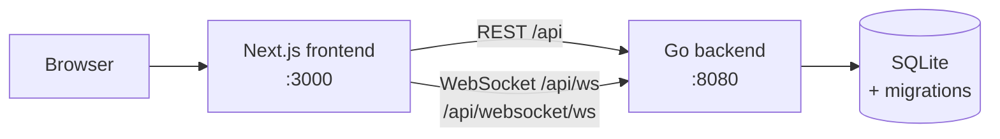

# Social Network

A Facebook-like social network with a **Go** backend, a **Next.js** frontend, and a **SQLite** database. It has profiles, followers, posts with privacy levels, groups, events, real-time chat, and live notifications. Frontend and backend run in separate **Docker** containers.

Built as a team project at **Zone01 Oujda**.

---

## Features

**Accounts and profiles**
- Register with email, password, first name, last name, and date of birth. Avatar, nickname, and "about me" are optional.
- Passwords are hashed with **bcrypt**. Sessions are kept with cookies.
- Profiles can be **public** or **private**, and the user can switch at any time.
- Each profile shows the user's info, posts, followers, and following.

**Followers**
- Follow and unfollow other users.
- Following a private profile sends a **follow request** that the owner can accept or reject.
- Friend suggestions.

**Posts and comments**
- Create posts with an optional image (JPEG, PNG, WebP).
- Three privacy levels:
  - **Public**: everyone
  - **Almost private**: followers only
  - **Private**: only the followers you choose
- Comment on posts and like them.
- Posts load page by page.

**Groups and events**
- Create a group with a title and description.
- Invite followers, or request to join. The group creator approves requests.
- Group members can post, comment, and chat inside the group.
- Create events with a title, description, and date. Members answer **Going** or **Not going**.

**Real-time chat**
- Private messages over **WebSockets**, between users who follow each other or with users who have a public profile.
- Group chat for every group.
- Emoji support, message history, and read status.

**Notifications**
- Live notifications over WebSockets for follow requests, group invitations, join requests, and new events.
- Notifications are saved, so they're still there after a page reload.

---

## Architecture



| Layer | Technology |
|---|---|
| Frontend | Next.js 15, React 19, CSS Modules, Zod |
| Backend | Go 1.24, standard `net/http` |
| Real-time | Gorilla WebSocket |
| Database | SQLite (`mattn/go-sqlite3`) |
| Migrations | `golang-migrate` (18 migrations, applied on startup) |
| Security | bcrypt, UUID session tokens, CORS middleware, rate limiting |
| Deployment | Docker, Docker Compose |

---

## Getting started

### Run with Docker (recommended)

```bash
git clone https://github.com/twlmed212/Social-Network.git
cd Social-Network
docker compose up --build
```

- Frontend: **http://localhost:3000**
- Backend API: **http://localhost:8080**

### Run locally

Requirements: Go 1.24+, Node.js 20+, and a C compiler (needed by `go-sqlite3`).

**Backend**

```bash
cd backend/cmd
go run .
```

The database is created in `backend/db/sqlite/` and all migrations run automatically.

**Frontend** (in a second terminal)

```bash
cd frontend
npm install
npm run dev
```

Open **http://localhost:3000**.

---

## Database

The schema is managed with versioned migrations in [`backend/db/migration/`](backend/db/migration). Each migration has an `up` and a `down` file.

Main tables: `users`, `sessions`, `posts`, `post_allowed`, `comments`, `likes`, `followers`, `follow_requests`, `groups`, `group_members`, `group_invites`, `events`, `event_presence`, `chats`, `group_chat`, `notifications`.

---

## API overview

| Area | Base route | Examples |
|---|---|---|
| Auth | `/api` | `POST /register`, `POST /login`, `GET /logout` |
| Posts | `/api/posts` | `POST /createpost`, `GET /getposts`, `GET /getsinglepost` |
| Comments | `/api/comment` | `POST /sendcomment`, `GET /getcomment` |
| Likes | `/api/likes` | `POST /react` |
| Users | `/api/users` | `GET /profile`, `PUT /privacy`, `POST /follow`, `POST /accept`, `POST /reject` |
| Groups | `/api/groups` | `POST /POST`, `POST /invite`, `POST /join`, `POST /{groupId}/newEvent` |
| Chat | `/api/websocket` | `/ws`, `GET /Get_Chat_History` |
| Notifications | `/api/ws` | WebSocket |
| Images | `/api/images/` | Uploaded images |

---

## Project structure

```
Social-Network/
├── docker-compose.yml
├── backend/
│   ├── cmd/main.go         # Server entry point and routes
│   ├── auth/               # Register, login, logout, sessions
│   ├── posts/              # Posts, privacy, pagination
│   ├── comments/
│   ├── likes/
│   ├── profile/            # Profiles, follow, requests, suggestions
│   ├── groups/             # Groups, invites, join requests
│   ├── events/             # Group events and RSVP
│   ├── chat/               # Private and group chat (WebSocket)
│   ├── notifications/      # Live notifications (WebSocket)
│   ├── middleware/         # CORS, auth check
│   ├── utils/              # Image upload, rate limit, logger
│   └── db/
│       ├── migration/      # SQL migrations (up / down)
│       └── sqlite/         # Database setup
└── frontend/
    └── src/
        ├── app/            # Pages: home, profile, groups, events, friends, notifications
        ├── components/     # UI components
        ├── context/        # User, friends, notifications state
        ├── hooks/
        └── lib/            # API and WebSocket clients
```

---

## What we learned

- Building a REST API and WebSocket server in Go
- Real-time features: chat, group chat, and live notifications
- Designing privacy rules for posts and profiles
- Managing a database schema with migrations
- Building a React app with Next.js and connecting it to a Go backend
- Running a multi-container app with Docker Compose
- Working as a team of 4 with Git: 269 commits across backend and frontend

---

## Team

- **Mohamed Tawil**: [@twlmed212](https://github.com/twlmed212)
- **Omar El Haouch**: [@elhaouchomar](https://github.com/elhaouchomar)
- **Zakaria Abdlali**: [@heyZakaria](https://github.com/heyZakaria)
- **Houda Hdili**: [@houdajeon](https://github.com/houdajeon)

## License

Free to use, modify, and distribute, as long as the original authors listed above are credited.
